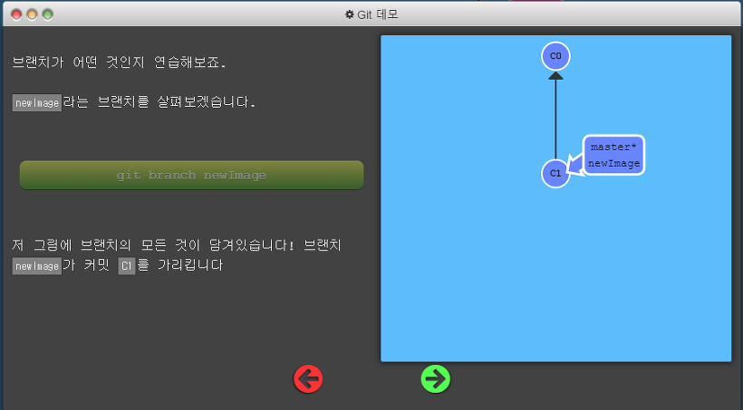

># git commit
git commit은 디렉토리에 있는 파일들의 변경사항을 기록하는 것을 말한다.  
git은 최대한 가볍게 유지하는 특성을 갖고 있어 이전버전과 다음 버전의 변경내역인 스냅샷만을 저장하고 있다.

그래서 보통 커밋을 할 때 디렉토리 전체를 복사하지 않고 commit을 하게 되면  
이전의 부모 commit 가르키게 됩니다.  
아래 그림의 *C1*이 *C0*을 가르키는 것과 같이..

  

여기서 git commit을 하게 되면 새로운 C2가 생성되며 C1을 가르키게 됩니다.  
**C2에서는 C1과 다른**, C1 이후의 변동사항이 기록되는 것 입니다.

 
># git branch

우선 branch는 _하나의 커밋과 그 부모 커밋들을 포함하는 작업 내역_ 이라고 알아 두고, 예제를 봅니다.

**git branch newImage** 를 통해 새로운 **newImage**라는 브랜치 생성,  
현재 **master**라는 브랜치가 C1을 가르키고 있어 같은 위치에 생성됩니다.

이 상태에서 **git commit**을 하게 되면 C2라는 새로운 commit이 생기고 master가 이를 가르키게 됩니다.  
그러나 새로 생성한 newImage 브랜치는 그대로 C1에 있는데,  
_이는 (*)가 master를 가르키고 있어, 현재 브랜치가 master에 있기 때문입니다._

만약 새로 생성한 _newImage라는 브랜치에서_ commit을 하고 싶다면  
*git checkout* 명령어를 통해 브랜치를 변경하면 됩니다.  
*git checkout newImage; git commit;*
 

 
># git merge

따로 생성된 브랜치들을 합치는 명령어인 *merge*

여러 하나의 부모로부터 갈라져 나온 두 개의 브랜치가 있습니다.  
이 두개의 브랜치를 합치고 싶을 때 **merge**를 사용합니다.

master  브랜치에서 **git merge bugFix** 를 하게 되면, 아래와 같이 새로운 커밋이 두 부모가 있던 커밋을 가리키게 됩니다.
  

이제 _bugFix_ 에서 _master_ 로 합쳐 봅니다.

  
 
># git rebase

브랜치끼리 작업을 합치는 두번째 방법, 커밋들을 모아서 복사한 뒤 다른 곳으로 떨궈? 놓는다고 합니다.  
rebase를 사용하면 커밋들의 흐름을 한 줄로 할 수 있는 장점을 갖고 있습니다.

두 개의 브랜치가 나눠져 있습니다.  
_C1_ 에서 _C2_,_C3_ 라는 기능을 각각 따로 개발을 한 경우 입니다.  
이제 _bugFix_ 브랜치에서 작업을 **master** 브랜치 위로 옮겨 놓게 되면,  
_실제로는 따로 개발했지만 마치 순서대로 개발한 것처럼 보이게 됩니다._

**bugFix**가 현재 브랜치인 상태에서 **git rebase master** 명령어를 실행하게 되면,

master가 그대로 남아있는데, master를 선택하고 **git rebase bugFix**를 실행한다면,  
결과는 아래와 같이 깔끔하게 정리가 됩니다.

 
 

># git HEAD

HEAD란 현재 체크아웃된 커밋을 가르키는 것으로, 현재 작업중인 커밋을 말합니다.  
**HEAD는 항상 작업트리의 가장 최근 커밋을 가리키며**, 작업트리에 변화를 주는 git 명령어들은 대부분 HEAD를 변경하는 것으로 시작됩니다.

HEAD 분리하기, HEAD를 분리하는 것은 _HEAD를 브랜치 대신 특정 커밋에 붙이는 것_ 을 의미합니다.  
일반적으로 HEAD는 브랜치를 가리키는데, 명령을 사용하기 전 모습은  
**HEAD -> master -> C1** 인데,  
_git checkout C1_ 을 하게 되면 **HEAD -> C1** 과 같이 가리키게 됩니다.  

 
 

># 상대참조

Git의 상대참조란 우리가 기억하는 지점(브랜치나 HEAD)을 기준을 기준으로 **다른 지점으로 이동**하는 작업을 말합니다.  
여기서는 **한 커밋 위로 올리는 ^**, **한번에 여러커밋을 올리는 ~<num>** 연산이 있습니다.

  

이렇게 C2를 가르키는 master 브랜치에서 한 커밋 위로 이동하고 싶다면,

**git checkout  master^**  
C1으로 HEAD가 이동한걸 볼 수 있습니다. 또한 **git checkout master^^** 를 통해 부모의 부모 커밋으로 이동도 가능합니다.

상대 참조는 브랜치 이름 외에도 HEAD를 통해서도 이동이 가능합니다.  
**git checkout HEAD^**

이렇게 ^ 연산자를 통해 계속 올라갈 수도 있지만 한번에 올라가는 갯수를 지정해주는 **~연산자**도 있습니다.

__git checkout HEAD~4__

**브랜치 강제로 옮기기**

-f 옵션을 통해 브랜치를 특정 커밋에 직접 재지정 할 수 있습니다.

**git branch -f master HEAD~3**

  
># git reset
git에서 작업한 내용 되돌리기 

**git reset HEAD~1**

  

###git revert

### push 한 상태라면 revert, 아니라면 reset

#> git cherry-pick

특정 커밋들을 가져온다.

master 브랜치(현재 C5 커밋)에서 C2와 C4의 커밋을 가져오고 싶다.  
**git cherry-pick C2 C4**

이런식으로 가져오게 됩니다.

__참조 사이트__  [Learn git Branching 사이트로 Git 기본 개념 다지기](https://huiyu.tistory.com/entry/Learn-Git-Branching%EC%82%AC%EC%9D%B4%ED%8A%B8%EB%A1%9C-Git-%EA%B8%B0%EB%B3%B8-%EA%B0%9C%EB%85%90-%EB%8B%A4%EC%A7%80%EA%B8%B0-main)